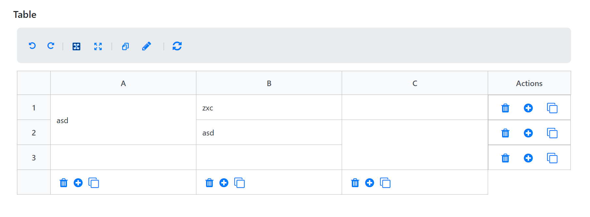
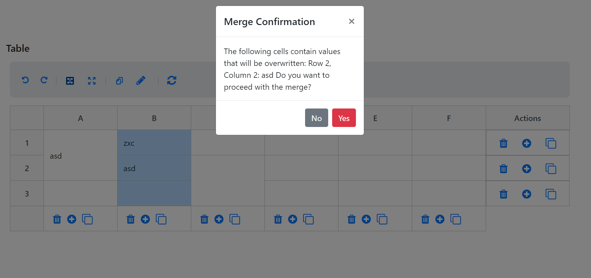
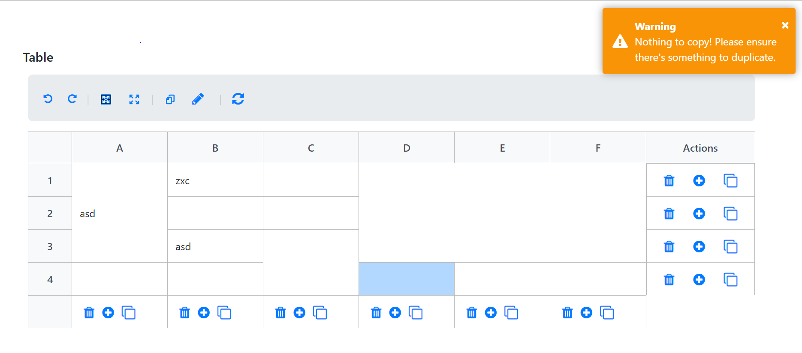

<h1>Angular Grid (on development)</h1>

<h2>Features:</h2>

- <strong>Merge Cells</strong>: Combine multiple cells into a single cell.
- <strong>Unmerge Cells</strong>: Separate previously merged cells.
- <strong>Select Range Cells</strong>: Select multiple cells at once for group operations.
- <strong>Duplicate Rows and Columns</strong>: Duplicate existing rows or columns for ease of editing.
- <strong>Copy & Paste</strong>: Copy data from one cell range and paste it into another.
- <strong>Undo & Redo</strong>: Revert or restore previous changes.
- <strong>Edit Value (Disabled)</strong>: Cell values are displayed but currently not editable.

  this is link for the Demo

  https://angular-grid-ivory.vercel.app/

<h3>Project Information</h3>

 This project implements an Excel-like grid interface with various features such as selecting cell ranges, merging cells, adding or duplicating rows and columns, and more. 

 The current implementation uses a matrix format for the table. Initially, the grid handles data from a non-matrix format by converting it into a matrix. This design was chosen due to requirements of an existing project, but there are plans to change both the sample data and the format structure in the future 

 The project is built with Angular 11 to maintain compatibility with existing systems, but there is potential for upgrading to a newer Angular version as needed. 

<h3>Technical Details</h3>

- <strong>Developed in:</strong> Angular 11
- <strong>Node Version:</strong> 14.17
- <strong>Status:</strong> In Development

There's some validation pop up or dialog when do some action

